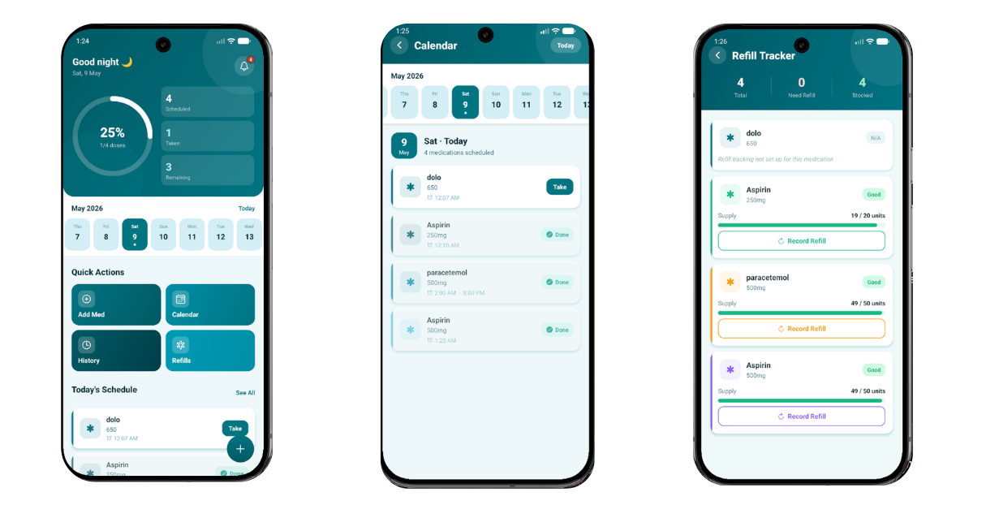
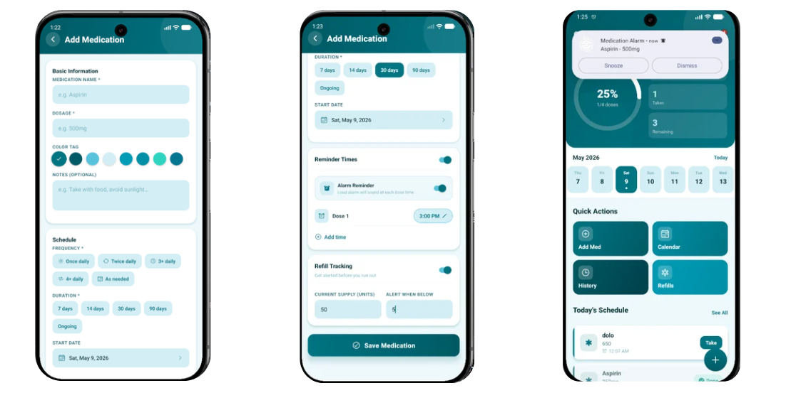

# MedRemind

A React Native medication management application that helps users manage medicine schedules, track dosage history, monitor refill reminders, and receive real  alarm-based medication alerts.

Built with **React Native**, **Expo**, **TypeScript**, and native **Android Kotlin** modules.

---

## Reminder and Alarm flow

## Features

- Medicine reminder scheduling
- Real Android alarm support
- Foreground alarm service
- Refill tracking system
- Medication history tracking
- Biometric authentication
- Modern responsive UI
- Persistent alarms after device reboot
- Multiple daily reminder scheduling

---

## Tech Stack

### Frontend
- React Native
- Expo
- TypeScript

### Native Android
- Kotlin
- AlarmManager
- Foreground Services
- Broadcast Receivers
- Native Modules

---

## Alarm System

Unlike standard notification-based reminder apps, MedRemind implements a native Android alarm architecture using Kotlin for reliable, exact-time medication alerts.

---

## Running the Project

### Expo Development
```bash
npx expo start
```

### Native Android Build
```bash
npx expo run:android
```

### Build APK
```bash
eas build --platform android --profile preview
```

